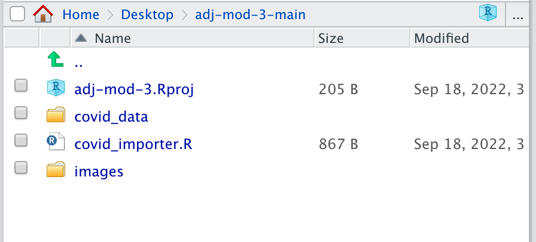
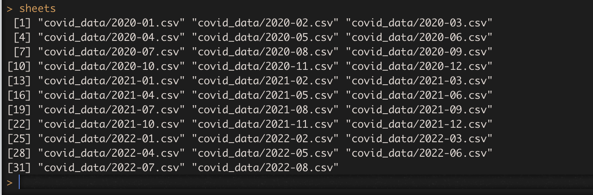
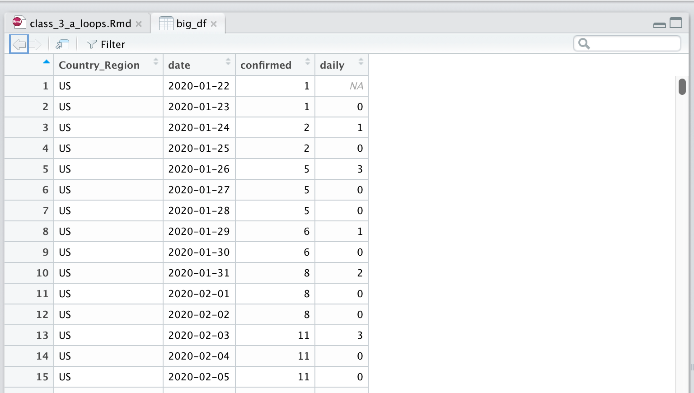

```{css, echo=FALSE}
.pageContent {
padding-top: 64px }

.cell-left {
  text-align: left;
}

.cell-right {
  text-align: right;
}

.cell-center {
  text-align: center;
}

table {
    margin: auto;
    border-top: 1px solid rgb(102, 102, 102);
    border-bottom: 1px solid rgb(102, 102, 102);
    display: table;
    border-collapse: separate;
    box-sizing: border-box;
    border-spacing: 2px;
    border-color: grey;
    padding-bottom:5px;
}
```

```{r setup, include=FALSE}
packages <- c("tidyverse", "lubridate", "rvest", "httr", "remotes", "usethis", "doParallel")
if (length(setdiff(packages, rownames(installed.packages()))) > 0) {
  install.packages(setdiff(packages, rownames(installed.packages())), repos = "https://cran.us.r-project.org")  
}

#remotes::install_github("rstudio/gradethis", upgrade="always", quiet=TRUE)
#remotes::install_github("rstudio/learnr", upgrade="always", quiet=TRUE)

library(tidyverse)
library(learnr)
library(gradethis)
library(lubridate)


```

<span style="color:white">welcome to class!</span>

## Loops

<iframe width="560" height="315" src="https://www.youtube.com/embed/-sxUXYNnXsA" title="YouTube video player" frameborder="0" allow="accelerometer; autoplay; clipboard-write; encrypted-media; gyroscope; picture-in-picture" allowfullscreen></iframe>

Before we move on, we need to go over some programming fundamentals.

One of which is how to create loops to simplify repetitive tasks.

Here's a basic "for loop" which includes setting the limits for the loop to 10.

```{r loop1, exercise=TRUE}
for (i in 1:10) {
  print(i)
}
```

Manually, this would have looked like `print(1)` then `print(2)` then `print(3)` one by one.

But this is a way to run code many times with slight variations to a value or values in the code. It all goes between the `{` and `}`.

What this did was it said `i` is 1 in the first loop.

The only function we used in the loop was to print whatever `i` was.

At the end it started over and moved `i` to the next number, 2.

Because we put `1:10` then it looped 10 times and then stopped.

Try it again in the code above with another number if you want.

**Note:** Using `i` is arbitrary. You could use any letter or object. But it does take the value of what shows up after `in`.

But we keep it simple because we'll be using that object often in the loop.

Other examples:

```{r loop2, exercise=TRUE}
states <- c("Texas", "Florida", "California", "New York", "Indiana", "Maine")

for (arbitrary_name in 1:length(states)) {
  print(______________)
}
```

```{r loop2-solution}
states <- c("Texas", "Florida", "California", "New York", "Indiana", "Maine")

for (arbitrary_name in 1:length(states)) {
  print(arbitrary_name)
}
```

```{r loop2-hint}
Just like the loop before it, we're printing the new version of i. 
But it's the new name we've come up with to replace i
```

```{r loop2-check}
grade_this_code()
```

**Important:** In the code above instead of 1:6, we typed `1:length(states)` which is the same thing as `1:6`.

But it's more generalized so we don't have to always look up how many objects there are in the array.

**Note** Remember, if you want to see how many objects there are in an array, use `length()` and if you want to see how many rows there are in a data frame, use `nrow()` and if you want to see how many columns there are in a data frame, use `ncol()`.

Notice that the output in the console were not the names of the states we have in our list because the object that's looping is a number. 

If you want to loop AND print the names in the array, you'll have to refer to the array and the loop number with brackets.

Plug in the function from **stringr** that concatenates strings together because that's what we're printing to the console.

Also! Notice how I'm using the `[i]` to pull out the state name from the array based on the ordering?

```{r loop3, exercise=TRUE}
states <- c("Texas", "Florida", "California", "New York", "Indiana", "Maine")

for (i in 1:length(states)) {
  print(_____("array object ", i, " is ", states[i]))
}
```

```{r loop3-solution}
states <- c("Texas", "Florida", "California", "New York", "Indiana", "Maine")

for (i in 1:length(states)) {
  print(str_c("array object ", i, " is ", states[i]))
}
```

```{r loop3-hint}
The function starts with a "s" and ends with a "c"
```

```{r loop3-check}
grade_this_code()
```

Excellent! Those are the basics of loops.

Let's apply that now for a practical purpose.

## Set up files

For these next steps, you're going to toggle between coding in RStudio while following this tutorial. You'll have to swap back and forth often. This is to get you more comfortable with coding in scripts and the console and not just in the safety of these exercises.

First, make sure you've downloaded the files by running the lines of code below (switch back to RStudio and click on the "Console" tab at the bottom left).

```
install.packages("usethis")
```

And then this line of code in the console of RStudio (it downloads some data from my github repo to your computer):

```
usethis::use_course("https://github.com/r-journalism/adj-mod-3/archive/master.zip")
```

It will ask you if it's okay to install the folder to your Desktop (click yes unless you want it somewhere else and then it will ask you if it's okay to delete the zip after installing).


This downloads the entire contents of a repo to your desktop (or any other folder you tell it to) that I've stored data in and opens it up in another RStudio instance.

You've got two RStudio projects running now! adjclass and adj-mod-3-main.

Then you can run the lines of code in this walkthrough in the adj-mod-3-main project and it will work!

Let's test that out with the data you downloaded:

```{r files_image1, out.width = "400px", echo=F}

```

These are the files you should have.

Check out the `covid_data` folder in your current `adj-mod-3-main` folder:


```{r files_image2, out.width = "400px", echo=F}
knitr::include_graphics("images/files2.png")
```

Let's bring in a couple data sets and make sure their structures are similar.

Run these lines in the console of adj-mod-3-main (and not in this tutorial this time).

```{r, eval=F}
# have to load in the r package to import data!
library(readr)

df1 <- read_csv("covid_data/2020-01.csv")

df2 <- read_csv("covid_data/2020-02.csv")

View(df1)
View(df2)
```

You've imported two months of Covid-19 data and then run commands to view the table in RStudio.

When you toggle back and forth between the table view of **df1** and **df2** you see the column names are the same, which is good.

Let's join them together. Type this out in your console:

```
df <- rbind(df1, df2)

View(df)
```

## Loops to read in data files

If you had to write a line of code to import every spreadsheet in the `covid_data` folder, that would take a long, long time because there are dozens!

Sometimes you're going to get data split out over several spreadsheets.

Loops are a great way to simplify things.

Here's our original loop code:

```{r loop2a, exercise=TRUE}
for (i in 1:10) {
  print(i)
}
```

To make this work on importing spreadsheets, you'll need to know:

1. How many times you need to run the loop
2. The names of the files 
3. Figure out what you want to do with the files

First, we need to get the list of spreadsheets that we want to import.

We'll use the function called `list.files()`.

Please type out the code below into your console in RStudio (or in a script that you can run if you want to save the code for later). Replace the text with the directory where the csvs are. If you get `character(0)` as the output you did not type out the command correctly.

```{r, eval=F}
sheets <- list.files("_____________", full.names =TRUE)

sheets
```

```{r files-image3, out.width = "400px", echo=F}

```

What's the command to figure out how many objects are in the array `sheets`?

```{r quiz1, echo=FALSE}
quiz(caption = "1",
  question("What's the command to figure out how many objects are in the array `sheets`?",
    answer('ncol(sheets)'),
    answer('nrow(sheets'),
    answer('length(sheets)', correct=T),
    answer('width(sheets)'),
    random_answer_order= TRUE
  ))
```

Okay, let's modify our original loop code.

This time in addition to printing code, let's include the function to import data, `read_csv()`.

And just like the states, we can use the `sheets[i]` to refer to specific sheets in the list.

Please type out the code below into your console in RStudio (or in a script that you can run if you want to save the code for later). Replace the text with the correct function.

```{r new, eval=F}
for (i in 1:_____(sheets)) {
  read_csv(sheets[i])
  print(sheets[i])
}
```

Okay! It looped and read the data!

But we messed up, it didn't save anywhere. And if we did like normal, each new loop would overwrite it.

We need to create a new data frame that saves each data frame and appends it to the original.

So let's modify the code again using a new idea from programming: if statements.

## If statements and loops

This is the basic structure for if statements. You need a `()` and `{}`.
```
if (logical test for true or false) { do something }
```

You can do multiple tests, too.

```
if (logical test for true or false) { 
      do something 
   } else if (logical test for true or false) { 
   do something else 
   } else { 
   do this if prior logical tests failed 
   }
```

Please type out the code below into your console in RStudio (or in a script that you can run if you want to save the code for later). Replace the text with correct function

```{r new_if, eval=F}
for (i in 1:_____(sheets)) {
  df <- read_csv(sheets[i])
  
  # if first time looping, save df as big_df
  if (i==1) {
    big_df <- df
  } else {
    # if not the first time looping, then rbind it to big_df
    big_df <- rbind(big_df, df)
  }
  
  print(nrow(big_df))
}

View(big_df)
```

Did it work for you?

```{r files-image4, out.width = "400px", echo=F}

```

Great! 

df1 had 10 rows and df2 had 29 rows but big_df has 934!

Now, there are better, more [efficient](https://www.gerkelab.com/blog/2018/09/import-directory-csv-purrr-readr/) ways to do this-- but loops are an important concept to learn.

Before you go, let's go over one more type of loop. 

## Parallelization

Imagine you could do loops but faster.

When we run scripts and loops currently, they're done one at a time in a serial form. The next task won't start until the one before it finishes.

But modern computers have multiple cores which enables multiple computations to take place at the same time.

There are [many ways](https://nceas.github.io/oss-lessons/parallel-computing-in-r/parallel-computing-in-r.html) to run loops in parallel in R, but we're going to use a package called **doParallel**.

Please open up a script in RStudio and type out these lines and then run it.

We're going to load the package and see how many cores your computer's working with.

```{r parallel, eval=F}
# if you haven't installed doParallel yet, uncomment and run this first.
# install.packages("doParallel")

library(doParallel)

detectCores()
```


Okay, hopefully you've got more than one.

If you do, let's move to the next step and tell R how many cores we want to use.

```{r parallel2, eval=F}
#### How many cores do you want to use?

registerDoParallel(cores=X)
```

Here's a look at our old loop code for importing spreadsheets.

Let's see how long it took by wrapping it up in the function `system.time()`

Copy and paste the code below into R and run it yourself.

```{r loop_time, eval=F}
system.time(
  for (i in 1:length(sheets)) {
    df <- read_csv(sheets[i])
    
    # if first time looping, save df as big_df
    if (i==1) {
      big_df <- df
    } else {
      # if not the first time looping, then rbind it to big_df
      big_df <- rbind(big_df, df)
    }
    
    print(nrow(big_df))
  }
)
```

Okay, this is how to do the process above but in parallel.

It uses a new function from **doParallel** called `foreach()` and uses`=` instead of `in`.

And we don't need the `if()` anymore, instead we pass the `rbind` function name as an argument.

```{r parallel_time, eval=F}

# you may need to type this instead as your foreach function:
# foreach(i=1:length(sheets), .combine=rbind, .packages="readr")

big_df <- foreach(i=1:length(sheets), .combine=rbind) %dopar% {
  read_csv(sheets[i])
}
```

Did it work when you ran it?

Let's test the speed.


```{r parallel_time2, eval=F}
# you may need to type this instead as your foreach function:
# foreach(i=1:length(sheets), .combine=rbind, .packages="readr")

system.time(
  big_df <- foreach(i=1:length(sheets), .combine=rbind) %dopar% {
    read_csv(sheets[i])
  }
)
```

What's the elapsed time for you here compared to the original elapsed time from the first loop?

On my computer, it cut my import time by more than half. This is probably different on your computer.

This was a simple example but imagine running a parallel loop an an intensive process.

One valid criticism about R is that because data is stored into memory, there is an actual limit to what processes it can run. But loops and parallelization can allow you to run analyses on smaller slices of the data before joining.

As a journalist on deadline, it could give you a competitive edge.

Alright! We did it!

You now have a handle on all the biggest verbs used to wrangle and transform data.

There are many more functions that do more specific things, of course.

But this will hopefully get you started on your way. Everything else you may have questions on how to do has probably been asked and answered out in the R online community.

## Class III - Part 2

Good job making it this far! 

We're well on our way to understanding and using these advanced data gathering techniques.

Next, we're going to apply what we've learned so far to getting data from APIs.

When you've rested up and feeling like you're ready to move on to the next part of module 3, just type this in the console of RStudio:

```
learnr::run_tutorial("class_3_b_apis", "adjclass")
```


