```{css, echo=FALSE}
.pageContent {
padding-top: 64px }

.cell-left {
  text-align: left;
}

.cell-right {
  text-align: right;
}

.cell-center {
  text-align: center;
}

table {
    margin: auto;
    border-top: 1px solid rgb(102, 102, 102);
    border-bottom: 1px solid rgb(102, 102, 102);
    display: table;
    border-collapse: separate;
    box-sizing: border-box;
    border-spacing: 2px;
    border-color: grey;
    padding-bottom:5px;
}
```
```{r setup, include=FALSE}
packages <- c("tidyverse", "lubridate", "rvest", "httr", "remotes",
              "rvest")
if (length(setdiff(packages, rownames(installed.packages()))) > 0) {
  install.packages(setdiff(packages, rownames(installed.packages())), repos = "https://cran.us.r-project.org")  
}

#remotes::install_github("rstudio/gradethis", upgrade="always", quiet=TRUE)
#remotes::install_github("rstudio/learnr", upgrade="always", quiet=TRUE)

library(tidyverse)
library(learnr)
library(gradethis)
library(lubridate)
library(jsonlite)
library(utils)
library(rvest)
tutorial_options(exercise.timelimit = 300)
url <- "https://www.amazon.com/product-reviews/B09XF2Z12G/"
amazon <- read_html(url)

total_reviews <- amazon %>% 
  html_elements("#filter-info-section .a-size-base") %>% 
  html_text() %>% 
  str_trim() %>% 
  str_replace(".*ratings, ", "") %>% 
  parse_number()

ratings <- amazon %>% 
  html_elements("#cm_cr-review_list .review-rating") %>% 
  html_text()

dates <- amazon %>% 
  html_elements("#cm_cr-review_list .review-date") %>% 
  html_text()

review_text <- amazon %>% 
  html_elements(".a-spacing-small.review-data") %>% 
  html_text()

some_reviews <- data.frame(ratings, dates, review_text)

```

<span style="color:white">welcome to class!</span>


## Intro

There's a lot of data out there and sometimes you can get it because it's been posted publicly. 

The best data for a journalist is a one that hasn't been scrutinized already. One common route for obtaining obscure data is the kind that some government agency does not want you to have so you have to pry it from their fingers through a public information request.

Another route is to scrape the data off the agency's website, transform it into tidy data, and then come up with stories based on the analysis.  And since we’re using R to do the web scraping, we can simply run our code again to get an updated data set if the sites we use get updated.

Agencies don't like to show their data because they fear others will misinterpret or even change their data. They've traditionally tried various gimmicks to control the presentation of data.

Sometimes locking a spreadsheet as read-only (doesn't really work). 

Sometimes by sending data over in PDFs. But OCR and table scraping programs have made that less frustrating as before (it still is, don't get me wrong).

In recent years, parties have tried to control the flow of information by presenting it in "interactive" dashboards. 

These dashboards, whether Shiny or Power BI or Tableau, are all the new PDFs when it comes to data accessibility. Sometimes these dashboards have "export data" capabilities but most of the time, that option is turned off.

So, let's go over some techniques to download the data into R.

We're going to go over some basics and **not** the advanced techniques that involve Javascript or fake cookies or headless browsers. That would take quite a few more modules. 

But that's okay because once you get used to basic scraping, you can move on to the next level.

Let's begin by understanding HTML and CSS.

## Web pages explained

To scrape a website effectively, we must understand the mechanics of a website.

A website may appear to just have text and images and text but the page itself is written in specific coding languages that are interpreted by web browsers.  

```{r files-image1, out.width = "100%", echo=F}
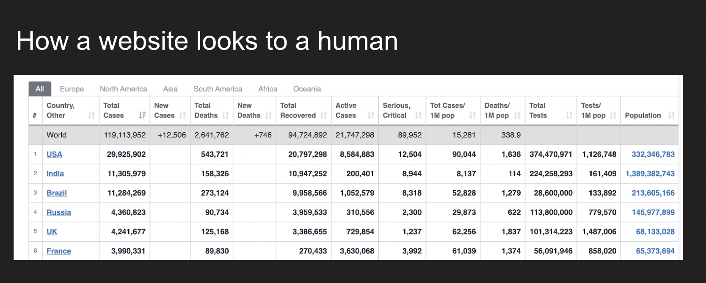
```

```{r files-image2, out.width = "100%", echo=F}
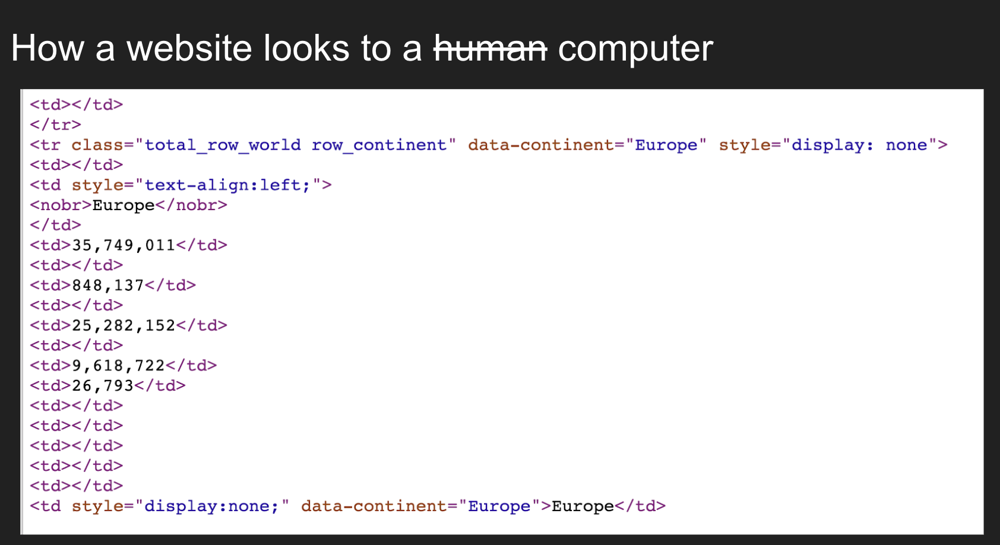
```


When scraping, we'll need to think like a web browser.

Web pages are usually built using Hypertext Markup Language (HTML) and Cascading Style Sheets (CSS) and Javascript. 

* HTML gives a website its structure and content
* CSS provide the style and look, like fonts and colors
* Javascript provides functionality

Javascript-generated data is a whole other endeavor that you'll have to learn on your own. Try [RSelenium](http://joshuamccrain.com/tutorials/web_scraping_R_selenium.html) once you master this module!

## HTML

HTML is organized using tags, which are surrounded by `<>` symbols. Different tags perform different functions. Together, many tags will form and contain the content of a web page.

The simplest HTML document looks like this:

```
<html>
<head>
```

Notice that the word **html** is surrounded by `<>` brackets, which indicates that it is a tag. To add some more structure and text to this HTML document, we could add the following:

```
<head>
</head>
<body>
<p>
Here's a paragraph of text!
</p>
<p>
Here's a second paragraph of text!
</p>
</body>
</html>
```

Different elements are wrapped around these tags (one at the beginning `<>` and end `</>`) and these tags can have classes. If you're curious about other tag types, you can explore [here](https://www.w3schools.com/tags/).

Notice how all the tags are nested?


```{r files-image3, out.width = "70%", echo=F}
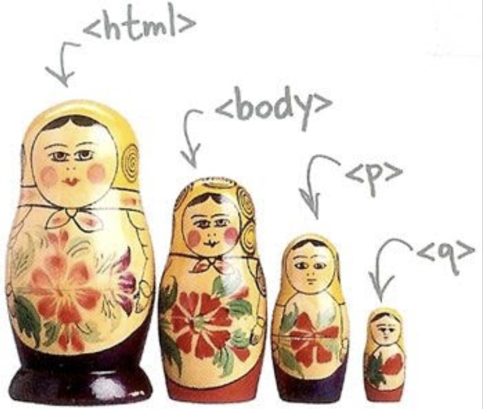
```

Many things in HTML are nested.

Here's an illustration of how a simple HTML table is structured

```{r files-image4, out.width = "100%", echo=F}
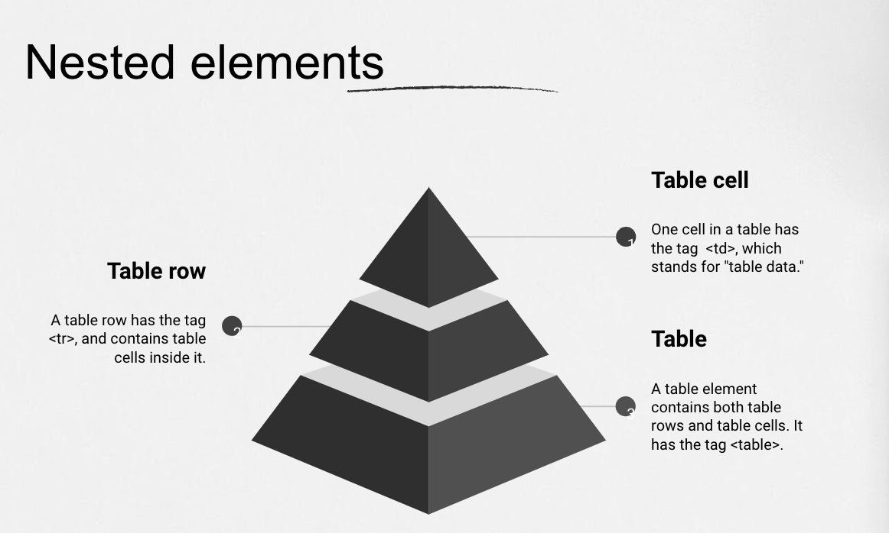
```

The entire thing is wrapped by `<table></table>` and in between are a few `<tr></tr>` for rows and then in that are `<td></td>` for individual cells.

## CSS

Two concepts to grasp before we start scraping are **classes** and **ids**.

When designing a website, there are going to be times when similar elements on a website should look the same.

Like, a list of items should always be orange.

We'd pull that off by directly inserting some CSS that contains that color description into each line of the HTML text.

```
<p style="color:orange">List item 1</p>
<p style="color:orange">List item  2</p>
<p style="color:orange">List 3</p>
```

The new `style` element indicates that we are trying to apply CSS to the `<p>` tags. Inside the quotes, we see a key-value pair "color:orange". color refers to the color of the text in the `<p>` tags, while orange describes what the color should be.

This isn't really efficient because we've typed it out three times.

Instead of repeating, we can replace it with a `class` selector:

```
<p class="oj-text">List item 1</p>
<p class="oj-text">List item  2</p>
<p class="oj-text">List 3</p>
```

The `class` selector now exists and we can define the orange color in a separate CSS file 

```
.oj-text {
    color : orange;
}
```

This way, as a designer, I can adjust one line in the main CSS file instead of 3 different ones.

This is important to know because when you're scraping data, you'll often need to pull from parts of the website with classes like the above.

The final important part of CSS to understand are **ids**.

CSS ids are used to give a single element an identifiable name, much like how a class helps define a class of elements.


```
<p id="special">This is a unique tag.</p>
```

There's a great tutorial on CSS selectors [here](https://flukeout.github.io/#) with 32 escalating exercises to help you narrow down different elements of a website based on classes or ids.

But we want to be a little bit more efficient because we're on deadline.

For this tutorial, you need to download and install an open source software named [Selector Gadget](http://selectorgadget.com/) that will install as an [extension](http://selectorgadget.com/) in your Chrome browser (Also, please use Chrome for this tutorial). You can access and download the Selector Gadget extension [here](http://selectorgadget.com/). 

Once you install it, the extension should appear up here.

```{r files-image5, out.width = "70%", echo=F}
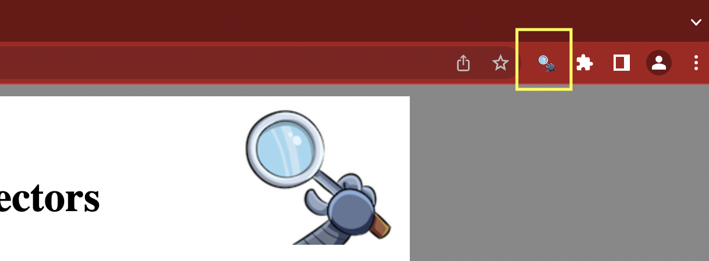
```

Using this you can select the parts of any website and get the relevant tags to get access to that part by simply clicking on that part of the website.

This a really useful shortcut.

Let's start scraping.

## rvest

We'll use a new package called [**rvest**](https://rvest.tidyverse.org/) and it's part of the tidyuniverse bundle. 

Load the library.

```{r}
library(rvest)
```

Let's pull reviews from Amazon for [this digital voice recorder](https://www.amazon.com/48GB-Digital-Voice-Recorder-Dictaphone/dp/B09XF2Z12G/). 


```{r files-image32, out.width = "80%", echo=F}

```

Let's track them down.

Scroll down to near the bottom of the product page are about 8 listed reviews. At the bottom of that section is a link for `See all reviews>`. Let's go see those reviews.

**Note:** Here's a tip.

The URL to the reviews may look like (once you strip out all the `ref` tracking code:

`https://www.amazon.com/48GB-Digital-Voice-Recorder-Dictaphone/product-reviews/B09XF2Z12G/`

But if you try this link, it works just as well.

`https://www.amazon.com/product-reviews/B09XF2Z12G/`

Turns out you don't need the product name, only the Amazon id.

Let's request the data from the server.

We'll use the `read_html()` function. It takes a URL as an argument.

Sub in the html of the digital voice recorder (second link) and the correct function name and run the code.

```{r rvest, exercise=TRUE}
url <- "_____"

amazon <- _________(url)

amazon
```

```{r rvest-solution}
url <- "https://www.amazon.com/product-reviews/B09XF2Z12G/"

amazon <- read_html(url)

amazon
```

```{r rvest-hint}
function starts with an *r*.

```

```{r rvest-check}
grade_this_code()
```

Great job, we've imported an html page into R.

Now let's extract what we want.

## Parse HTML


There are a lot of data we could get but let's focus on these elements:

* Number of stars (out of 5)
* Date review was posted
* Text of review

We'll need to find the HTML/CSS elements to target.

One way is to use [**inspect element**](https://www.freecodecamp.org/news/how-to-inspect-an-element-chrome-shortcut/) but since we've already installed **selector gadget** we'll use that instead.

Okay, scroll past the first two banner reviews and go to the reviews in the list. 

Click on the **selector gadget** button in the browser and click on the stars.

A pop up box will show up on the bottom right and after you click on the first stars, `.review-rating` will appear. What you selected also is highlighted in green and similar elements on the web page that match that `.review-rating` will also be highlighted green and yellow.

However, when double checking, I see that the two banner reviews are included. I don't want those! So I can click on the green of one of them and it will exclude that and selector gadget will try to guess another element. This time, `#customer_review etc etc etc`, which is way too long and too specific because it excluded the stars below the first star we wanted. So we click on the stars beneath the first one we wanted and we finally get all the stars we wanted. *Look below to see how the path changes with each additional click to remove or add elements until we get the final one we want.* 


```{r files-image6, out.width = "100%", echo=F}
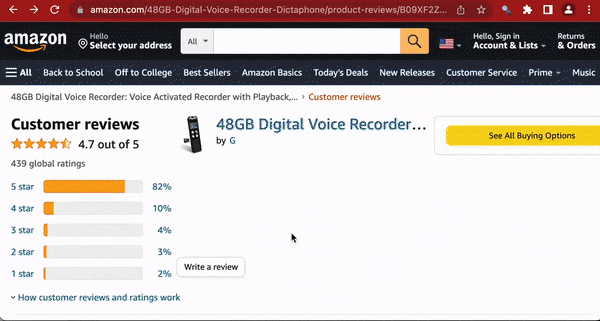
```

This time the final CSS class we want is `#cm_cr-review_list .review-rating`.

We need to pass that string into a new function: `html_elements()`. (An older version of rvest used to be `html_nodes()`)

We already have the read html saved in the **amazon** object.

Use the new function and the class below.

```{r read_html, exercise=TRUE}
amazon %>% 
  _________("__________________")
```


```{r read_html-solution}
amazon %>% 
  html_elements("#cm_cr-review_list .review-rating")
```

```{r read_html-hint}
function starts with an *h*.

```

```{r read_html-check}
grade_this_code()
```

Alright, we're closer.

What that did was returned all the nodes in the HTML that have this particular `#cm_cr-review_list .review-rating` class. 

Now we need to extract the actual review number!

Let's pipe in `html_text()` with no arguments needed.

```{r html_text, exercise=TRUE}
ratings <- amazon %>% 
  _________("__________________") %>% 
  _________()

ratings
```


```{r html_text-solution}
ratings <- amazon %>% 
  html_elements("#cm_cr-review_list .review-rating") %>% 
  html_text()

ratings
```

```{r html_text-hint}
function starts with an *h*.

```

```{r html_text-check}
grade_this_code()
```


Great job! 

Now we have an array with various star ratings.

We can go back and clean these later so we have just the raw number.

So, the **read_html()** and **html_elements()** and **html_text()** functions are all you'll need for many common web scraping tasks.

* Get the HTML for the webpage you want
* Decide what part of the page to focus on and figure out what HTML or CSS to select it
* Select that HTML and analyze it

There are others, though. 

* `html_attr()` for grabbing links
* `html_table()` to parse an html table into a data frame
* `html_form_submit()` if you want to set values in a form submission

To check it all out, visit the [rvest site](https://rvest.tidyverse.org/reference/index.html).


Keep going!!

## More scraping

In your browser, to exit the **select gadget** tool, you must click the "X" button on the far right of the pop up box.

Or click the 'clear' button if you want to select a new element.

Which is what you want to do!

Now, use the select gadget to find the path for the dates of the reviews (it may take 3 or 4 clicks of selector gadget to find just the right selection). We'll save it to the object "dates".

```{r html_text2, exercise=TRUE}
dates <- amazon %>% 
  html_elements("__________________") %>% 
  _________()

dates
```


```{r html_text2-solution}
dates <- amazon %>% 
  html_elements("#cm_cr-review_list .review-date") %>% 
  html_text()

dates
```

```{r html_text2-hint}
The element you're looking for is similar to the previous one you used but with "date"
```

```{r html_text2-check}
grade_this_code()
```

Finally, get me the text of the reviews from customers and save it to the object "review_text".

This may take 3-5 clicks on **selector gadget** to get just the right selection. Don't include banner text reviews and don't include text from other parts of the website.

```{r html_text3, exercise=TRUE}
review_text <- amazon %>% 
  _________("__________________") %>% 
  _________()

review_text
```


```{r html_text3-solution}
review_text <- amazon %>% 
  html_elements(".a-spacing-small.review-data") %>% 
  html_text()

review_text
```

```{r html_text3-hint}
.a-spacing-small.review-data
```

```{r html_text3-check}
grade_this_code()
```


Great job. Let's bring it all together in one pretty data frame.

```{r dataframe, exercise=TRUE}
some_reviews <- data.frame(ratings, dates, review_text)

glimpse(some_reviews)
```

That's a lot of strings!

We want the numbers and dates!

Okay, let's clean it up a bit with some **stringr** and **lubridate** functions.

```{r clean, exercise=TRUE}
some_reviews <- some_reviews %>% 
  mutate(
         # Need to get the ratings into a numeric format instead of sentence format
         ratings=str_replace(ratings, " out of 5 stars", ""),
         ratings=as.numeric(ratings),
         # Need to turn the dates into a date format instead of sentence format
         dates=str_replace(dates, ".* on ", ""),
         dates=mdy(dates),
         # Let's get rid of extra spaces and \ns that indicate line breaks in the html code
         review_text=str_trim(review_text))

glimpse(some_reviews)
```

Ah, much nicer.


## Looped scraping

Alright, not bad!

We have 10 reviews so far. 

But how do we get all the reviews?

We could create a loop but we need to know what page to end on, otherwise you could get stuck in an infinite loop. **That's no good.**

Usually, there's a button that lets you get to the last page, but that's not available.

So we'll have to get creative. 

First, we need to figure out the structure of a URL when it goes to page 2.

Click to the next page and notice how the URL changes.

If you play around with it, you can see that the basic thing the review page needs to move to the next page is appended to the link like `?ie=UTF8&reviewerType=all_reviews&pageNumber=2`.

So we can just change the `pageNumber=` and keep scraping!

Okay, explore the reviews page and look for this part.


```{r files-image12, out.width = "100%", echo=F}
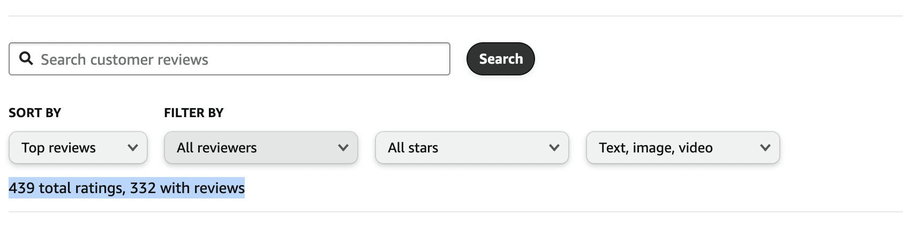
```

Aha, 332 total (at least when this screenshot was taken). 

We want the reviews, not just the ratings.

We could just plug in that number but what if we want to run this scraper in the future?

We should eliminate as many manual steps as possible

Let's isolate that out using **select gadget**.

If you click around, you'll get `#filter-info-section .a-size-base`.

Let's pull that out and see what that looks like.

```{r final, exercise=TRUE}
total_reviews <- amazon %>% 
  html_elements("#____________ .________") %>% 
  html_text()

total_reviews
```


```{r final-solution}
total_reviews <- amazon %>% 
  html_elements("#filter-info-section .a-size-base") %>% 
  html_text()

total_reviews
```

```{r final-hint}
Put in what was located with the select gadget.

```

```{r final-check}
grade_this_code()
```

Yuck, that's messy. This is all the code behind what's displayed!

`\n`s are pretty much line breaks (enters).

Let's use a **stringr** function, `str_trim()` and then get rid of the text so we only have the number. These functions should look really familiar to you! And then use the function to replace parts of the string with another.

```{r final2, exercise=TRUE}
total_reviews <- amazon %>% 
  html_elements("#filter-info-section .a-size-base") %>% 
  html_text() %>% 
  _______() %>% 
  ___________(".*ratings, ", "") %>% 
  parse_number()

total_reviews
```


```{r final2-solution}
total_reviews <- amazon %>% 
  html_elements("#filter-info-section .a-size-base") %>% 
  html_text() %>% 
  str_trim() %>% 
  str_replace(".*ratings, ", "") %>% 
  parse_number()

total_reviews
```

```{r final2-hint}
Use the stringr functions
```

```{r final2-check}
grade_this_code()
```


We know there are 10 reviews per page. and more than 360 total.

We can use that in our loop.

## Scraping loops


We know that each page has 10 reviews. We know how many total reviews there are.

So we can figure out the number of pages by dividing reviews by 10.

Run the code below and you'll have it.

We'll set a timer at the end of the loop to wait 2 seconds after each loop so we don't overwhelm their servers (or get banned). The function is `Sys.sleep(2)`.

It'll take `2*total_reviews/10` seconds to finish, so be patient.

```{r looped2, exercise=TRUE}

for (i in 1:round(total_reviews/10)) {
  base_url <- "https://www.amazon.com/48GB-Digital-Voice-Recorder-Dictaphone/product-reviews/B09XF2Z12G/?ie=UTF8&reviewerType=all_reviews&pageNumber="
  new_url <- str_c(base_url, i)
  amazon <- read_html(new_url)

  ratings <- amazon %>% 
  html_elements("#cm_cr-review_list .review-rating") %>% 
  html_text()

  dates <- amazon %>% 
  html_elements("#cm_cr-review_list .review-date") %>% 
  html_text()

  review_text <- amazon %>% 
  html_elements(".a-spacing-small.review-data") %>% 
  html_text()

  some_reviews <- data.frame(ratings, dates, review_text) %>% 
    mutate(ratings=str_replace(ratings, " out of 5 stars", ""),
         ratings=as.numeric(ratings),
         dates=str_replace(dates, ".* on ", ""),
         dates=mdy(dates),
         review_text=str_trim(review_text))
  
  if (i == 1) {
    all_reviews <- some_reviews
  } else {
    all_reviews <- rbind(all_reviews, some_reviews)
  }
  Sys.sleep(1)
}

all_reviews
```

## Intercepting the JSON

Sometimes you may not need to scrape a website if you can find the JSON a website loads to run.

If you enable ["Inspect Element"](https://sbgi.net/tv-stations/) in your browser, you can see all the pieces that a website needs to run when you reload it.

For example, what if you wanted to get the locations of all Sinclair Broadcast Group television stations if you were writing a story about the consolidation of local news?

You'd visit [this website](https://sbgi.net/tv-stations/) and find an interactive map of all the stations and their addresses.

But scraping this would not be easy.

So this is what you could do instead:

1) Visit https://sbgi.net/tv-stations/


```{r files_png1, out.width = "80%", echo=F}
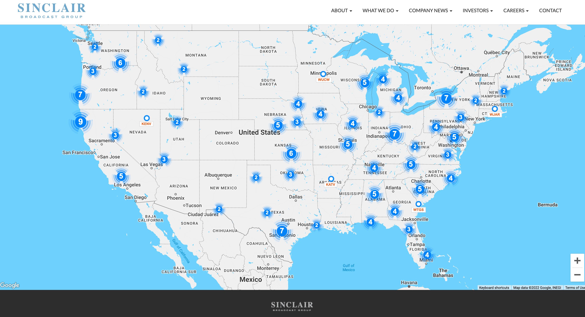
```

2) Right click until you have options at the bottom that says "Inspect" and click that

```{r files_png2, out.width = "80%", echo=F}
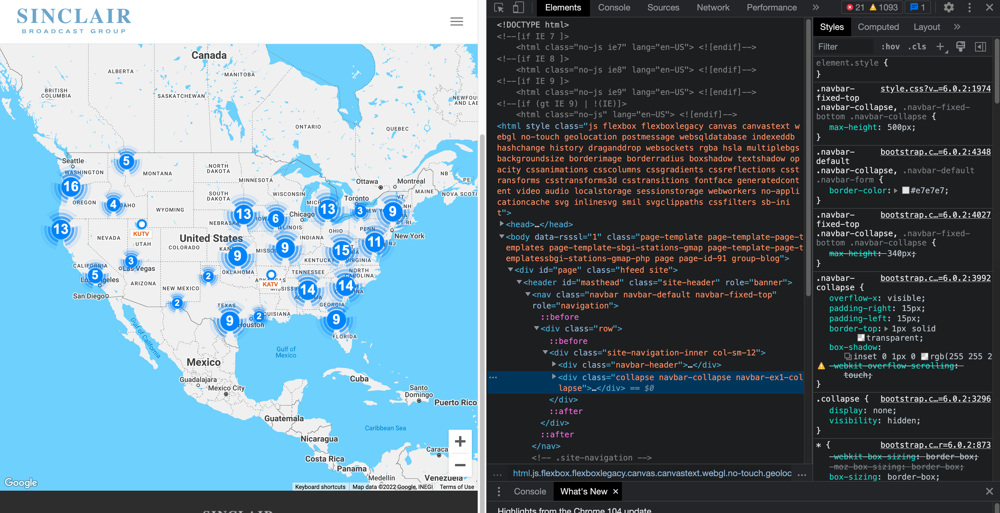
```

3) Switch from the "Elements" tab over to the "Network" tab-- these are all the various files that load. Do a search for json until only MetaverseStationData.json? shows up


```{r files_png3, out.width = "80%", echo=F}
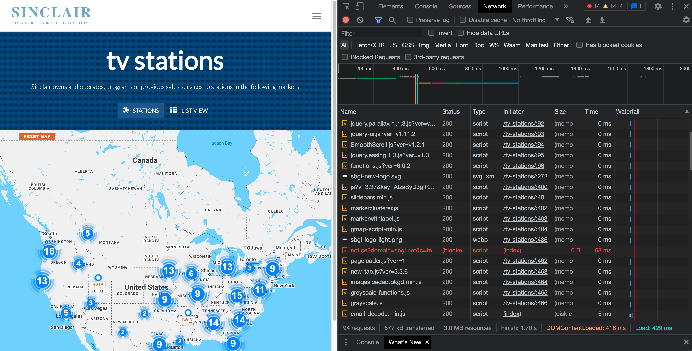
```

4) Right click and open that in a new tab


```{r files_png4, out.width = "80%", echo=F}
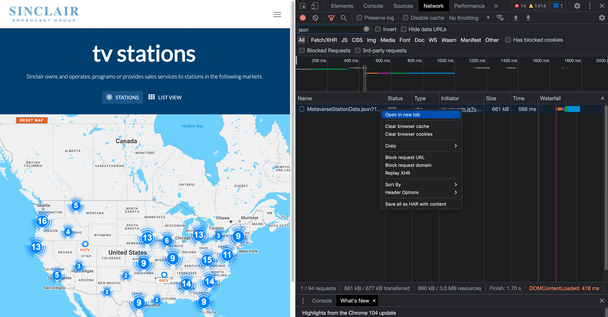
```

5) Now you have the [json url](https://sinclairresources.s3.amazonaws.com/assets/sbgi/MetaverseStationData.json?1663533398739) to use with fromJSON if you wanted to bring it into R


```{r files_png5, out.width = "80%", echo=F}
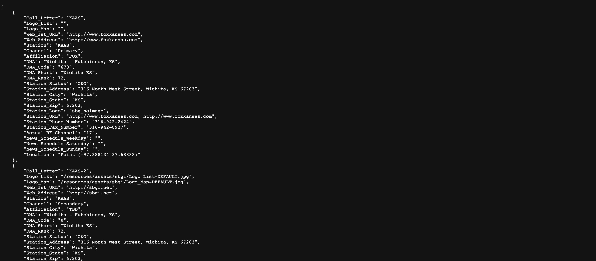
```

If you wanted to map it, I came up with a [walkthrough](https://r-journalism.com/posts/2018-07-17-sf-sinclair-map/map/) a few years ago (the links are outdated but you have the latest version of the JSON to sub it out).

## Ethical considerations

As The Markup staff [note](https://themarkup.org/news/2020/12/03/why-web-scraping-is-vital-to-democracy), "journalists have used scrapers to collect data that rooted out extremist cops, tracked lobbyists, and uncovered an underground market for adopted children."

If you scrape data, try to follow these general rules:

1) Do not overwhelm their servers. Put in pauses so you're not effectively running a distributed denial of service attack on them.
2) Do not display any raw data that could identify individuals in the data
3) Only show data relevant to your story and proves your methodology and not any proprietary information

Scraping is up for deeper discussion and debate so feel free to agree/disagree, offer other considerations in the discussion board!

## Done!

Congrats on completing the walkthroughs for Module 3!

Fill in the quiz answers and be sure to participate in the discussion boards if you haven't yet.

See you next time for Module 4 when we dig into statistics and mapping!


