```{css, echo=FALSE}
.pageContent {
padding-top: 64px }
```

```{r setup, include=FALSE}
packages <- c("tidyverse", "lubridate", "rvest", "httr", "remotes", "leaflet")
if (length(setdiff(packages, rownames(installed.packages()))) > 0) {
  install.packages(setdiff(packages, rownames(installed.packages())), repos = "https://cran.us.r-project.org")  
}

#remotes::install_github("rstudio/gradethis", upgrade="always", quiet=TRUE)
#remotes::install_github("rstudio/learnr", upgrade="always", quiet=TRUE)

library(tidyverse)
library(learnr)
library(gradethis)
library(lubridate)
library(leaflet)

#pharmacies <- read_csv("https://github.com/r-journalism/adj-mod-4/raw/master/data/all_pharmacies_summarized.csv")
pharmacies <- read_csv("https://github.com/andrewbtran/NICAR-2020-mapping/raw/master/data/all_pharmacies_summarized.csv")
state <- pharmacies

pharm_state <- pharmacies %>% 
  filter(BUYER_STATE=="LA")

pharm_state_arranged <- pharm_state %>% 
  arrange(desc(per_person))
```

<span style="color:white">welcome to class!</span>


## Intro to leaflet

Let’s create a locator map like you would when searching for an address on Google Maps.

The repo containing the data and scripts for this section is on Github. To follow along, simply run the lines of code below in R.

```{r, eval=F}
install.packages("usethis")
usethis::use_course("https://github.com/andrewbtran/adj-mod-4/archive/master.zip")

# This section is in scripts/02_leaflet_locator_map.R
file.edit("scripts/02_leaflet_locator_map.R")
```

Sometimes it’s necessary to zoom in or pan around a map for greater comprehension while exploring data spatially.

The Leaflet R package was created by the folks behind RStudio to integrate with the popular opensource JavaScript library.

It’s great for journalists who have little knowledge of JavaScript who want to make interesting interactives using R. And there is [excellent documentation](https://rstudio.github.io/leaflet/) if you want to dig deeper into its functionality after this introduction.

Essentially, this package lets you make maps with custom map tiles, markers, polygons, lines, popups, and geojson. Almost any maps you can make in Google Fusion Tables or Carto(DB), you can make in R using the Leaflet package.

```{r, eval=F}
# This function checks if you don't have the correct packages installed yet
# If not, it will install it for you
packages <- c("dplyr", "httpuv", "readr", "leaflet", "sf")
if (length(setdiff(packages, rownames(installed.packages()))) > 0) {
  install.packages(setdiff(packages, rownames(installed.packages())), repos = "https://cran.us.r-project.org")  
}

library(leaflet)
library(dplyr)
```

## Putting a marker on a map

Let’s begin by finding a latitude and longitude to map.

Go to [Google Maps](https://www.google.com/maps/) and search for any address.

Right click on the map until you get this menu.


```{r files-image1, out.width = "100%", echo=F}
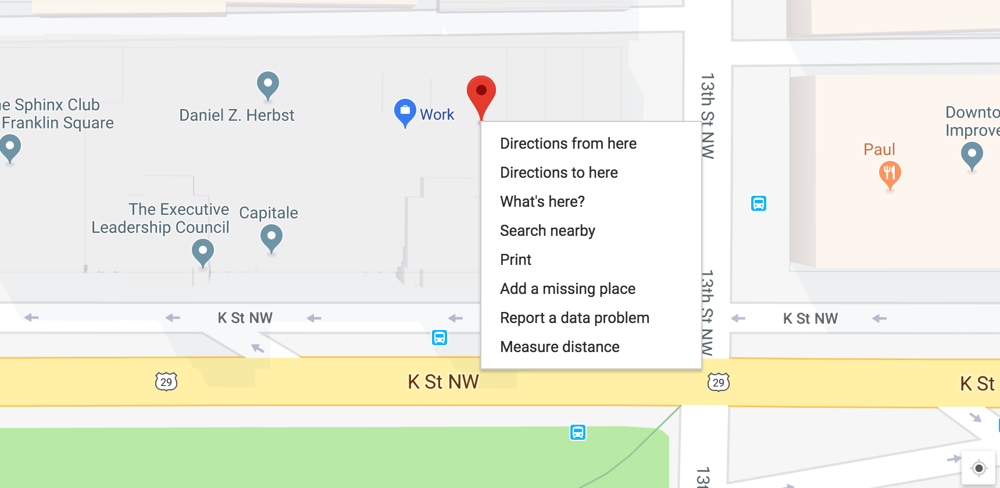
```

1. Create a map widget by calling the leaflet() function
2. Add layers (such as features) to the map by using layer functions
  * like addTiles, addMarkers, addPolygons
3. Print the map widget
4. Customize the view port zoom and center location with setView()

```{r}
# Insert your latitude and longitude in the code below
# NOTE: Don't get them reversed otherwise you'll end up in the South Pole.

# Initialize and assign m as the leaflet object
m <- leaflet() %>%
# Now add tiles to it
    addTiles() %>%  
# Setting the middle of where the map should be and the zoom level
    setView(lng=-77.030137, lat=38.902986, zoom = 16) %>%
# Now, add a marker with a popup, 
    addMarkers(lng=-77.030137, lat=38.902986, popup="<b>Hello</b><br><a href='https://www.washingtonpost.com'>-Me</a>")

m 
```
Go ahead and click the blue marker.

**Explaining the R code**

* `leaflet()` initializes the leaflet work space
* `addTiles()` by itself will bring in the default OpenStreetMap tiles
  * Here’s a list of free leaflet tiles you can use
  * Note: OpenStreetMaps is a wonderful and free open-source service. Their only stipulation for using their tiles is to be sure to credit and link to them in the map.
* `setView()` is pretty self-explanatory but is simpler to implement
* `addMarkers()` with some specific parameters.

**Note:** The order of commands is important. A view can’t be set unless there are tiles established first.

## Locations from a csv

Let’s bring in some new data based on pharmacies. This is opioid pain pill data for Louisiana between 2006 and 2012 via the arcos api (shameless self-promotion here since I made this api with R and the plumber and pkgdown packages).

```{r, eval=F}
library(readr)

pharmacies <- read_csv("data/all_pharmacies_summarized.csv")
```

```{r glimpse}
glimpse(pharmacies)
```

We’ve imported more than 82,000 rows of data on pharmacies across the U.S. and how many opioids they ordered between 2006 and 2012. If you’d like to see the script that generated this data, check out the `state_pharm_data.R` script.

Let’s limit it to a single state because tens of thousands of dots on a slippy map is taxing on a browser. Maybe we’ll get more ambitious later.

**Pick a state, any state.**
*I'll use Louisiana here for now.*

```{r, eval=F}
pharm_state <- pharmacies %>% 
  filter(BUYER_STATE=="LA")
```

Let’s make a map with a new tile set. Instead of leaving `addTiles()` empty, which uses the OpenStreetMap default, we’ll pass on some new data to some other third-party tiles with the `addProviderTiles()` function. Check out all the neat [tile options](https://leaflet-extras.github.io/leaflet-providers/preview/index.html).

Some options to use with `addCircles` includes the data to pull in for `popup` and `color`, which we’ve made bright orange. We’ve also set `radius` and `weight` and `fillOpacity`.

If we wanted to change the radius of the circle based on some data point, you could replace `40` with some column with numeric values in it.

And of course we have to change the latitude and longitude values in `setView()` so they focus on the state we filtered.

````{r map}
m <- leaflet(pharm_state) %>% addProviderTiles(providers$CartoDB.DarkMatter) %>% 
  setView(-92.469698, 31.012156, zoom = 7) %>% 
  addCircles(~lon, ~lat, popup=pharm_state$BUYER_NAME, weight = 3, radius=40, 
                 color="#ffa500", stroke = TRUE, fillOpacity = 0.8) 
m
```

That’s a start but we can do better.

We can reflect the average number of pills per person per year by the size of the circles.

To do that, we must switch from `addCircles` to `addCircleMarkers`.

Change that in the radius variable below.

And we’ll adjust the pop up language with some basic html.

```{r new}
# we also have to rearrange the order of the dataframe
# so the smaller values will render over the larger ones
# this means big circles won't block the small circles

pharm_state <- pharm_state %>% 
  arrange(desc(per_person))

m <- leaflet(pharm_state) %>% 
  addProviderTiles(providers$CartoDB.DarkMatter) %>% 
  setView(-92.469698, 31.012156, zoom = 7) %>% 
  addCircleMarkers(~lon, ~lat, 
             popup=paste0(pharm_state$BUYER_NAME, "<br />",
                          pharm_state$per_person, " pills per person per year"),
             weight = 3,
             radius=sqrt(pharm_state$per_person)*3, 
             color="#ffa500", 
             stroke = FALSE, 
             fillOpacity = 0.3) 
m
```

Why stop there?

Let’s make some style changes based on the data we have.

Like, we can visualize the `BUYER_BUS_ACT` with colors.

```{r arranged}
cof <- colorFactor(c("#ffa500", "#13ED3F"), domain=c("CHAIN PHARMACY", "RETAIL PHARMACY"))
# mapping based on type
m <- leaflet(pharm_state) %>% 
  addProviderTiles(providers$CartoDB.DarkMatter) %>% 
  setView(-92.469698, 31.012156, zoom = 7) %>% 
  addCircleMarkers(~lon, ~lat,
             popup=paste0(pharm_state$BUYER_NAME, "<br />",
                          pharm_state$per_person, " pills per person per year"),
             weight = 3,
             radius=sqrt(pharm_state$per_person)*3, 
             stroke = FALSE, 
             fillOpacity = 0.3,
             # this line below is really the only thing that's different
             color=~cof(BUYER_BUS_ACT)) 
m
```

Play around with the slippy map. Interesting, right?

Still, that’s a lot of points to process. I don’t recommend more. Unless you switch to a method that won’t slow your browser down, which we’lll get into soon.

## Add a legend

Let’s add a legend with the function addLegend() and options for where to place it and colors and labels.


```{r legend}
m <- leaflet(pharm_state)  %>% 
  addProviderTiles(providers$CartoDB.DarkMatter) %>% 
    setView(-92.469698, 31.012156, zoom = 7) %>% 
  addCircleMarkers(~lon, ~lat,
             popup=paste0(pharm_state$BUYER_NAME, "<br />",
                          pharm_state$per_person, " pills per person per year"),
             weight = 3,
             radius=sqrt(pharm_state$per_person)*3, 
             stroke = FALSE, 
             fillOpacity = 0.3,
             color=~cof(BUYER_BUS_ACT))   %>%
             # this line below is really the only thing that's different
             addLegend("bottomright", 
                       colors= c("#ffa500", "#13ED3F"), 
                       labels=c("Chain", "Retail"), 
                       title="Pharmacy type") 

m
```

### Better legend

Let’s add circles to the legend.

We want to add some customization to the legend to reflect the radius size on the map. This isn’t among the default functions in the rleaflet package, but it’s doable if you know how the underlying code works both in leaflet and rleaflet.

```{r better}
# set legend features
        colors <- c("gray", "gray", "gray", "#ffa500", "#13ED3F")
        labels <- c("5 pills", "15 pills", "30 pills", "Chain", "Retail")
        sizes <- c(sqrt(5)*3, sqrt(15)*3, sqrt(30)*3, 15, 15)
        shapes <- c("circle", "circle", "circle", "square", "square")
        borders <- c("gray", "gray", "gray", "#ffa500", "#13ED3F")

addLegendCustom <- function(map, colors, labels, sizes, shapes, borders, opacity = 0.5){

            make_shapes <- function(colors, sizes, borders, shapes) {
                shapes <- gsub("circle", "50%", shapes)
                shapes <- gsub("square", "0%", shapes)
                paste0(colors, "; width:", sizes, "px; height:", sizes, "px; border:3px solid ", borders, "; border-radius:", shapes)
            }
            make_labels <- function(sizes, labels) {
                paste0("<div style='float: right; display: inline-block;height: ", 
                       sizes, "px;margin-top: 4px;line-height: ", 
                       sizes, "px;'>", labels, "</div>")
            }
            legend_colors <- make_shapes(colors, sizes, borders, shapes)
            legend_labels <- make_labels(sizes, labels)

            return(addLegend(map, colors = legend_colors, labels = legend_labels, opacity = opacity))
        }

## okay, back to our map code but replacing the addLegend() function
## with our new addCustomLegend() function
        
m <- leaflet(pharm_state)  %>% 
  addProviderTiles(providers$CartoDB.DarkMatter) %>% 
    setView(-92.469698, 31.012156, zoom = 7) %>% 
  addCircleMarkers(~lon, ~lat,
             popup=paste0(pharm_state$BUYER_NAME, "<br />",
                          pharm_state$per_person, " pills per person per year"),
             weight = 3,
             radius=sqrt(pharm_state$per_person)*3, 
             stroke = FALSE, 
             fillOpacity = 0.3,
             color=~cof(BUYER_BUS_ACT))   %>%
             # this line below is really the only thing that's different
             addLegendCustom(colors, labels, sizes, shapes, borders)

m
```

## Interactive dashboard

Sometimes you need an interactive map that you can host internally for reporting purposes, maybe to show an editor or fellow reporters.

We’re going to build on what we’ve already learned and use two really new packages: [crosstalk](https://rstudio.github.io/crosstalk/) and [flexdashboard](https://rmarkdown.rstudio.com/flexdashboard/).

### Crosstalk

Crosstalk builds on top of the [htmlwidgets](https://htmlwidgets.org/) package (which has been creating all the stuff you’ve been putting in iframes from R) by letting different elements “talk” to each other.


```{r files-image1b, out.width = "100%", echo=F}
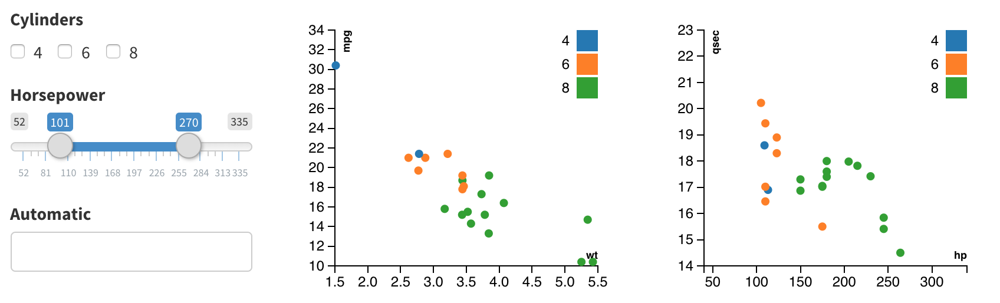
```

This lets you alter one interactive by clicking around in another. Usually for filtering.

This level of control is something that one would have to create in R using Shiny, which would require a server and perhaps Docker knowledge.

But Crosstalk doesn’t require Shiny. You can use it alone or use R Markdown to generate a static HTML document you can host anywhere.

Some limitations: At the moment it can only links individual data points and not aggregate or summary views. The next big limitation is that you shouldn’t use it for huge data sets because it will be all served in a browser.


### Flexdashboard

[**Flexdashboard**](https://rmarkdown.rstudio.com/flexdashboard/index.html) is simply a package that helps organize [interactive dashboards](https://rmarkdown.rstudio.com/flexdashboard/examples.html) using [bootstrap](https://getbootstrap.com/).

## Setting up

We’re going to create a truly interactive map and table to visualize pharmacy-level data in Louisiana. The data is from the [arcos api](https://wpinvestigative.github.io/arcos/). Basic packages we’ll use include [rleaflet](https://rstudio.github.io/leaflet/) and [DT: DataTables](https://rstudio.github.io/DT/).

I’ll be referring to different .Rmd files to work from as well as screenshots of the results. I’ll be highlighing code in this walkthrough but the code won’t really work in your console.

You must click the *Knit > Knit to flex_dashboard* button to execute and generate the html file.


```{r files-image3, out.width = "100%", echo=F}
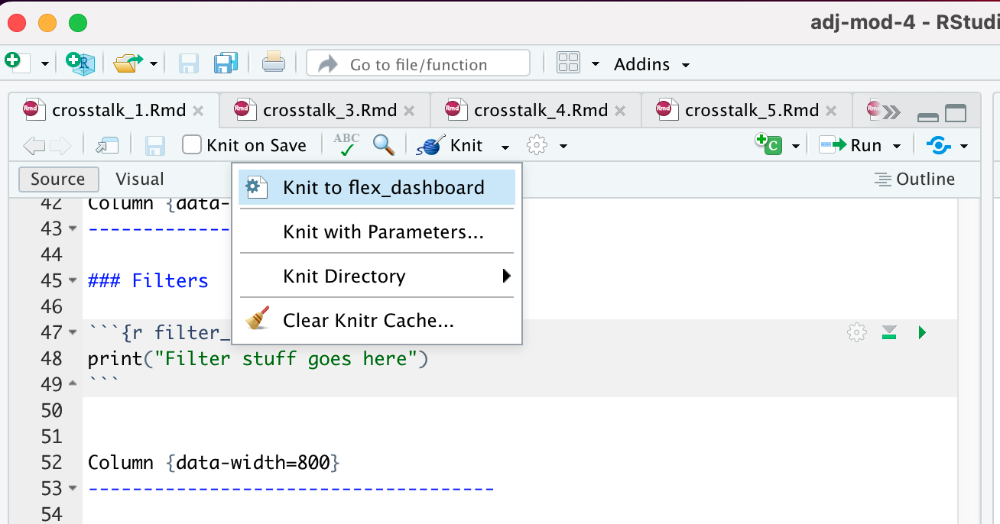
```

The repo containing the data and scripts for this section is on Github. To follow along, simply run the lines of code below in R.

```
# There is no need to run these install lines below if you already have done so
install.packages("usethis")
usethis::use_course("https://github.com/r-journalism/adj-mod-4/archive/master.zip")

# This section is in scripts/crosstalk_1.Rmd
# This section is in scripts/crosstalk_2.Rmd
# This section is in scripts/crosstalk_3.Rmd
# This section is in scripts/crosstalk_4.Rmd
# This section is in scripts/crosstalk_5.Rmd

file.edit("scripts/crosstalk_1.Rmd")
file.edit("scripts/crosstalk_2.Rmd")
file.edit("scripts/crosstalk_3.Rmd")
file.edit("scripts/crosstalk_4.Rmd")
file.edit("scripts/crosstalk_5.Rmd")

```

We’re going to build this in R Markdown.

R Markdown is a way to integrate R code with markdown language that translates into readable style, so you can integrate R analysis in slideshows, pdfs, websites, and dashboards. There's a lot of [cool stuff](https://rmarkdown.rstudio.com/) you can do. It's often how I write out my analysis memos to share with other reporters and editors.

The progression of code will be in `crosstalk_1.Rmd` through `crosstalk_5.Rmd` that you'll have to run on your computer not through this exercise.

### The data

We’re working with data I’ve already joined and summarized based on raw arcos data.

If you want to see the code looks like, it’s in the script folder called `99_state_pharm_data.R`

This is what the summarized data looks like:

```{r state, eval=F}
library(tidyverse)
state <- read_csv("data/all_pharmacies_summarized.csv")
```

```{r glimpsed}
glimpse(state)
```

It’s every store in the country. It has total pills (oxycodone and hydrocodone) within the time span of our data. And it has `per_person` which adjusts total for population by county. **Most importantly**, each pharmacy has latitude and longitude data so we can use to put these locations on a map.

## Set up structure

This section is in `crosstalk_1.Rmd`.

The first thing you’ll notice at the top of the .Rmd file is the text between the — signs. This is the [yaml](https://yaml.org/) part of the file that tells RStudio how to knit the file. Sometimes the output is pdf, sometimes it’s html, sometime it’s simple markdown.

In this instance, we’re exporting this file as a flex dashboard, with a [theme](https://www.datadreaming.org/post/r-markdown-theme-gallery/) of paper (You could come up with [your own theme](https://ijlyttle.github.io/communicate_custom_html_document_format_r_markdown.html) if your organization wants a consistent style).

```
---
title: "Crosstalk File 1"
author: "ADJ Interactive Maps"
date: "9/26/2022"
output:
  flexdashboard::flex_dashboard:
    theme: paper
    source_code: embed
---
```

Okay, that’s basic.

Beneath it are the sections of code that are indicated with a ```{r.


```{r files-image4, out.width = "100%", echo=F}
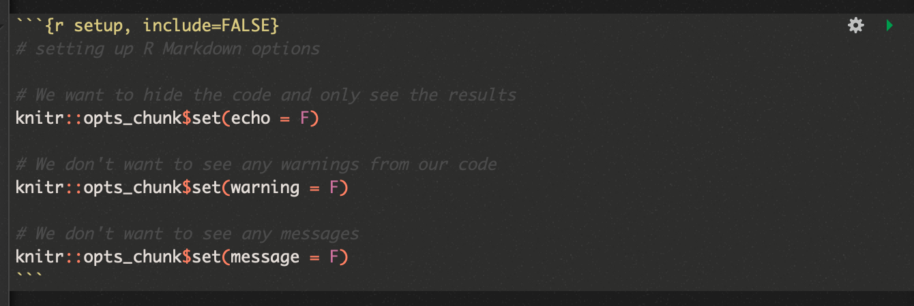
```

Anything within this chunk will be treating like a specific code.

The “r” in ```{r indicates that R code will be executed.

If you put in ```{python then Python code would be executed in the R markdown.

Anything outside of these ``` will be treated like regular markdown.

Take the time to learn more ways to customize your [R Markdown code](https://rmarkdown.rstudio.com/lesson-1.html).

The important thing to understand is this next set of code that sets up the modules you want to show with flex dashboard. Check out [their documentation](https://rmarkdown.rstudio.com/flexdashboard/using.html#layout).

```
Opioids in State {data-icon="ion-stats-bars"}
=====================================  

Column {data-width=200}
-------------------------------------

### Filters
```

This is specific markdown code that flex dashboard recognizes.

It takes data from the yaml section and the text in the code above and sets the header, the column width and what to name that particular section.

We’re only going to print text in each R code chunk to see where things end up.

Click *Knit > Knit to flex_dashboard* on the `crosstalk_1.Rmd` file.


```{r files-image5, out.width = "100%", echo=F}
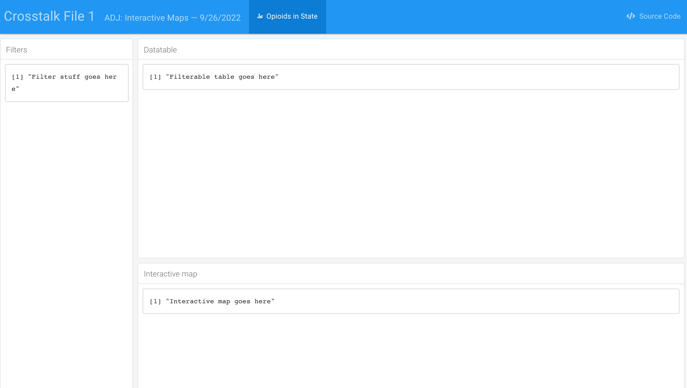
```


Pretty nice, right?

Even nicer considering how we typed zero HTML and CSS.

## Loading and displaying data pt 1

This section is in `crosstalk_2.Rmd`.

Alright, let’s bring in data and show what it looks like as a filterable table.

We’re going to skip the filtering part for now.

We looked at it in our console already but we need to load it into the R markdown file.

Look in the new chunk called `load_and_clean_data`


```{r files-image6, out.width = "100%", echo=F}
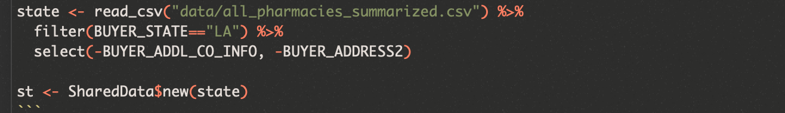
```

The important takeaway here is that after loading and filtering the data frame and storing it as `state`, we then used the `SharedData$new()` function to convert `state` into a crosstalk object.

This is like an enhanced data set. You’ll see why in a bit.

Look at the `filterable_table` chunk, now.

```{r files-image7, out.width = "100%", echo=F}
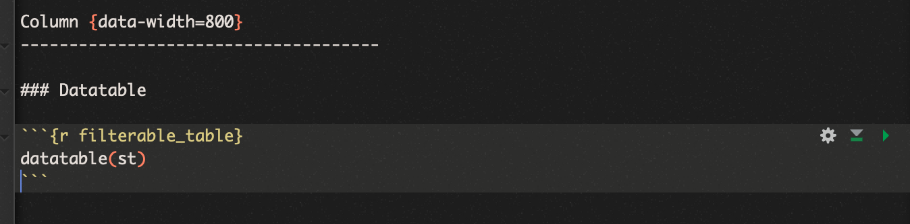
```

We’ve used the `datatable()` function to show the `st` crosstalk dataframe object.

Click *Knit > Knit to flex_dashboard* on the `crosstalk_2.Rmd` file.


```{r files-image7b, out.width = "100%", echo=F}
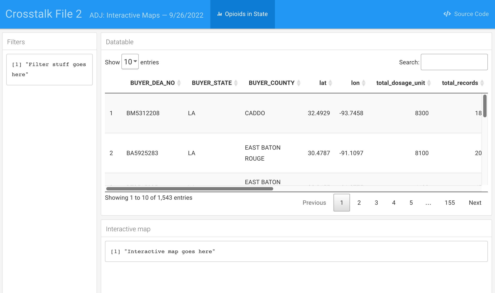
```

## Custom filters

This section is in `crosstalk_3.Rmd`.

We’re going to alter the `filter_section` code chunk.


```{r files-image8, out.width = "100%", echo=F}
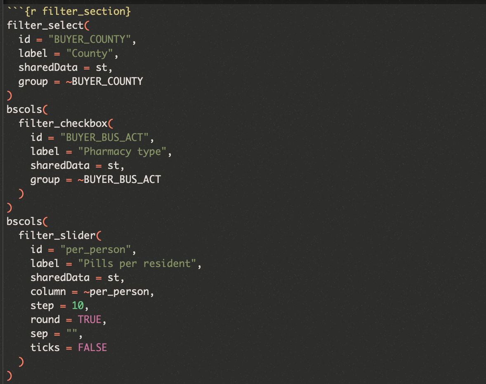
```

We’re using a few crosstalk specific filter functions: `filter_select()`, `filter_checkbox()`, and `filter_slider()` that will let us choose how to filter the **st** shared data object.

We’ve wrapped a couple of them around an additional function: `bscols()` that will pair up a couple of the narrower filters so it looks pretty.

Click *Knit > Knit to flex_dashboard* on the `crosstalk_3.Rmd` file.


```{r files-image9, out.width = "100%", echo=F}
knitr::include_graphics("images/flexdash3.png")
```

Neat, huh?

When we add filters on the left, either with a pull down menu or with the check box or via the slider bar, the table on the right will automatically update.

## Interactive map

This section is in `crosstalk_4.Rmd`.

We’re going to alter the `interactive_map` code chunk.

You’ve gone through the leaflet section before. Now, this is tricky.

We’re starting with the **st** crosstalk shared object but the values we’re setting for radius (`addCircles()`) and the text that we’re using to generate the popup text are based on the original **state** dataframe.


```{r files-image10, out.width = "100%", echo=F}
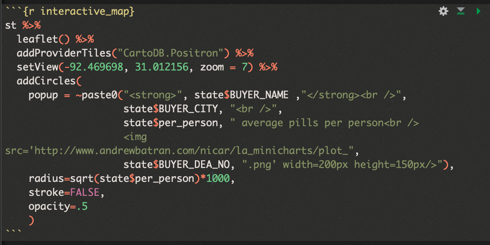
```

Also, you might have noticed I added some custom images to the popups depending on the **BUYER_DEA_NO**. These files are specific to Louisiana and show a pharmacy’s monthly opioid ordering trend compared to the state average.

Click *Knit > Knit to flex_dashboard* on the `crosstalk_4.Rmd` file.


```{r files-image11, out.width = "100%", echo=F}
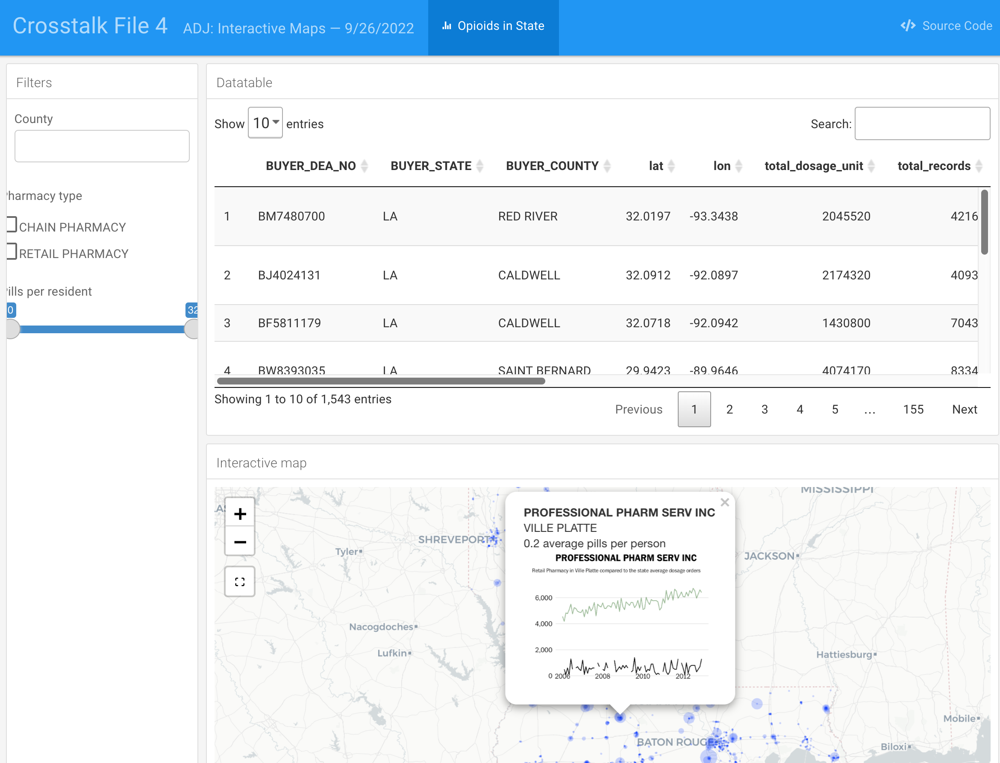
```

## Final datatable options

Almost done. Let’s go back and add some variables to the `datable()` function so we can add some neat customization to it, such as buttons to export the filtered data and scrolling options.

This section is in `crosstalk_5.Rmd`.

We’re going to alter the `filterable_table` code chunk.

Here’s a preview of what we’re changing.

For complete documentation of what’s available as DT options, visit [their site](https://rstudio.github.io/DT/).


```{r files-image12, out.width = "100%", echo=F}
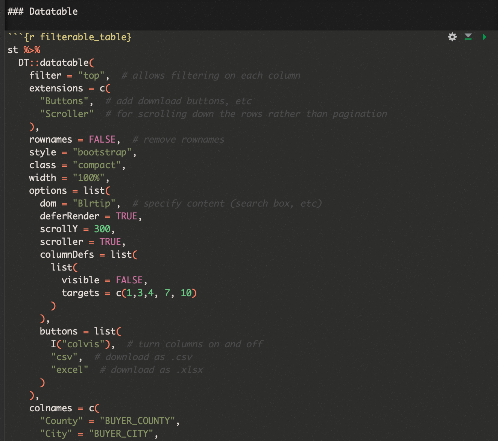
```

Click *Knit > Knit to flex_dashboard* on the `crosstalk_5.Rmd` file.


```{r files-image13, out.width = "100%", echo=F}
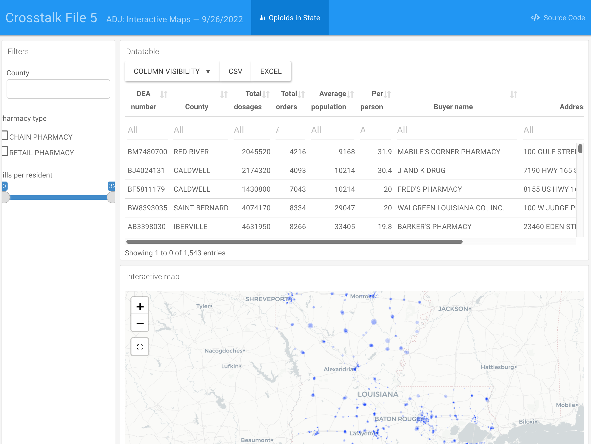
```

Beautiful!

