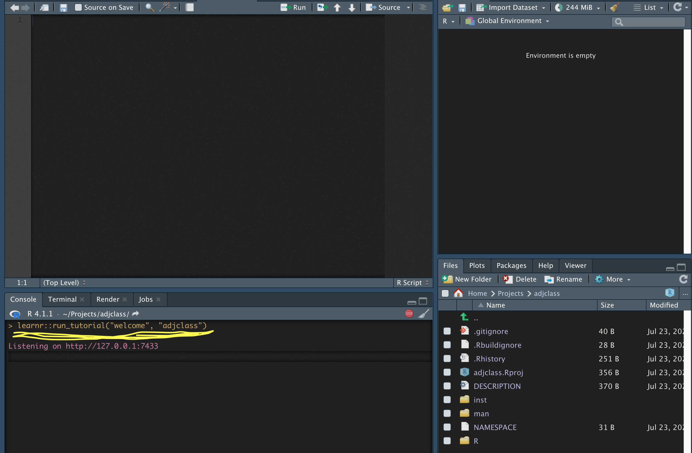
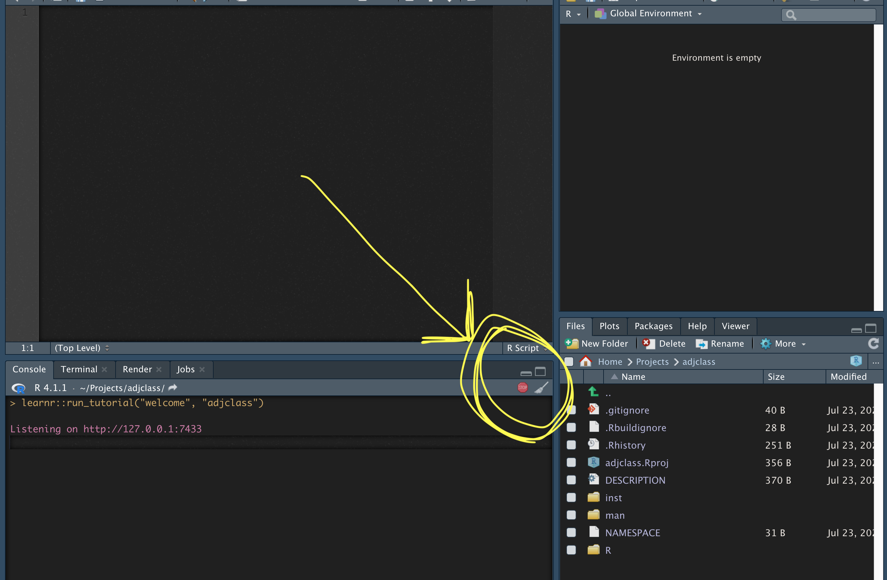
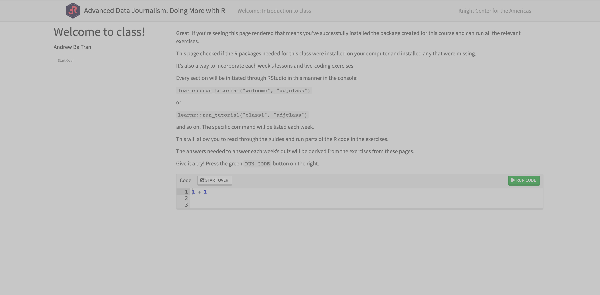

```{r setup, include=F}
packages <- c("tidyverse", "lubridate", "rvest", "httr", "remotes")
if (length(setdiff(packages, rownames(installed.packages()))) > 0) {
  install.packages(setdiff(packages, rownames(installed.packages())), repos = "https://cran.us.r-project.org")  
}

remotes::install_github("rstudio/gradethis", upgrade="always", quiet=TRUE)
remotes::install_github("rstudio/learnr", upgrade="always", quiet=TRUE)


library(learnr)
library(gradethis)
```

<span style="color:white">welcome to class!</span>

## Starting the tutorials

Great! If you're seeing this page rendered that means you've successfully installed the package created for this course and can run all the relevant exercises.

This page checked if the R packages needed for this class were installed on your computer and installed any that were missing.

It's also a way to incorporate each week's lessons and live-coding exercises. 


Every time you want to run the tutorial, you'll have to initiate it through RStudio with a command in the console:

Like: 
`learnr::run_tutorial("welcome", "adjclass")`

Or for future weeks, like:

`learnr::run_tutorial("class1", "adjclass")`

{width=100%}

and so on. The specific command will be listed each week on journalismcourses.org.

This will allow you to read through the guides and run parts of the R code in the exercises.

The answers needed to answer each week's quiz will be derived from the exercises from these pages.

Give it a try! Press the green `RUN CODE` button on the right.

```{r addition, exercise=TRUE}
1 + 1
```

Okay, now let's try it again but this time you have till fill in the blank.

What do you have to add to 1 to get to 5?

Try pressing `Run Code` before typing in the answer. See what happens.

Then fill in the correct answer and press `Run Code`.

```{r tidy2, exercise=TRUE}
1 + 
# add line above
```

```{r tidy2-solution}
1 + 4
```

```{r tidy2-check}
grade_this_code()
```

<div id="tidy2-hint">
**Hint:** Type in 4 and press 
</div>

In most of these tutorials, you won't be able to proceed until you type in the correct code.

Now, click `Next Topic` to move to the next section.


## Stopping the tutorials

You can always click on the links on the left to switch back to previous chapters in the tutorial.

You'll want to know how to stop these tutorials if you're done or if you want to continue using RStudio, perhaps to run some scripts on your own or use RStudio normally.

If the tutorial is currently running, simply switch from your browser to RStudio and click the red stop sign above console.

{width=100%}


You'll know this has been successful if your browser tab with the tutorial goes gray and becomes unclickable.

{width=100%}

## Catching up before class begins

If you're new to R or you'd like a refresher before class officially begins, please run the following command in your console and run through the exercises (be sure to stop this particular tutorial first otherwise you won't be able to run any code in the console):

```
learnr::run_tutorial("class_prep_pt1", "adjclass")
```


